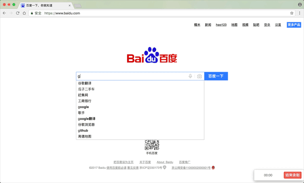
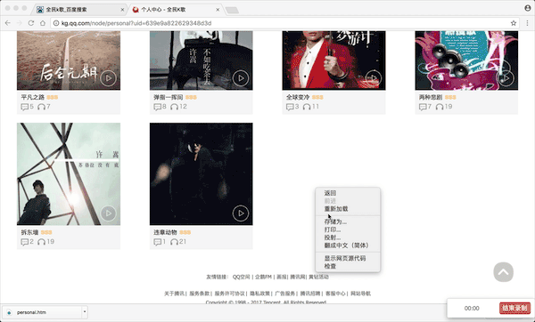
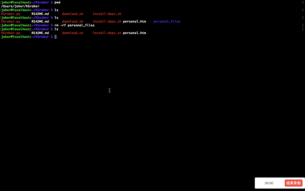
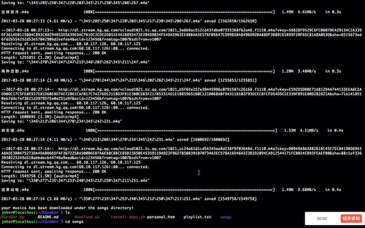

# KGraber

**这是一个用来从网页版全民K歌抓取用户自己作品并下载到本地的脚本**

---
Author: wangzhizhou(Joker)

Email: 824219521@qq.com

---
- 运行脚本需要`python3`环境，并且有`pip`包管理器支持

- 需要安装`git`和`wget`下载工具

	- MacOS: brew install wget git
	
	- Linux: sudo apt-get -y install wget git

## 整个抓取过程如下面Gif演示

### 1.下载KGraber工程到本地



```
git clone https://github.com/wangzhizhou/KGraber.git
```
### 2.登录全民K歌个人中心，获取全部音乐列表


### 3.以全部网页形式保存个人中心音乐列表网页到KGraber工程目录下



```
-_-# 这部分需要手动操作了，我功力还不能解决这部分自动化问题
```

###  4.运行脚本下载你的所有音乐到KGraber工程下的songs目录下面



```
./dowload.sh
```

### 5.查看songs目录下下载的音乐的个数




## 注意


* 应该保存网页为htm扩展名的文件`personal.htm`，这是因为脚本中对文件的读取已经写死。`Chrome`浏览器默认保存为`.htm`的文件。如果你使用其它的浏览器，保存文件后名字可能是`personal.html`，请把`html`修改为`htm`扩展名，便于脚本正常运行。文件名称固定为`personal`。

* 在个人中心下拉加载全部音乐后，一定要把网页保存成为`全部网页`的格式，不能保存成html源码，因为全部音乐列表是通过javascript获得的，如果只保存成为`html`源码格式会导致`personal.htm`文件中的音乐列表不全，脚本也就只能下载到部分音乐了。

* `install-deps.sh`脚本是用来安装python3解析`html`文本所需的第三方库`BeautifulSoup4`

* `KGraber.py`的作用是从`personal.htm`中解析出用户音乐列表的下载地址和对应用文件名，运行结果保存	在生成的`playlist.txt`文件中。
	
* `download.sh`会在内部调用上面的脚本，并创建一个名为`songs`的目录，把用户的所有歌曲下载到该目录中

下面的命令可以查看总共下载了多少个音乐文件,如果发现数量不正确，可以重新执行，直到数量正确为止。有时脚本运行过程可能被网络状况不良中断。这个问题，留待以后解决。

```
cd songs
ls -l | wc -l
```

**Enjoy It**


